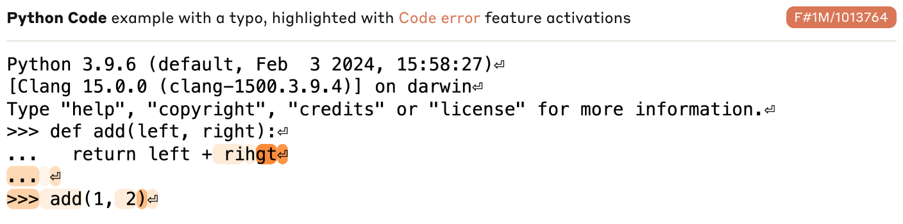
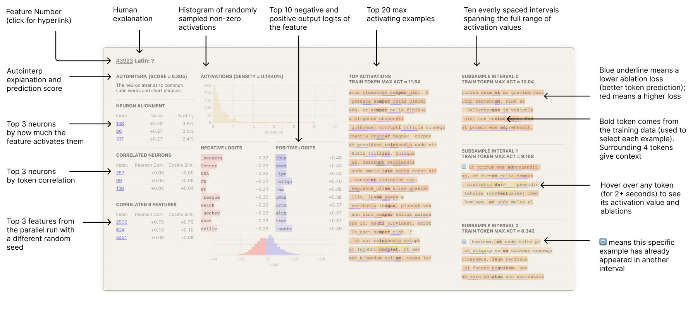
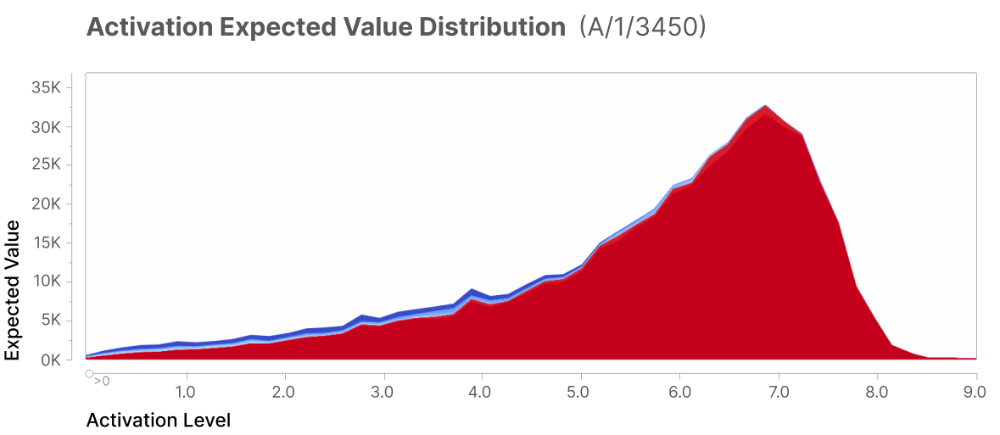
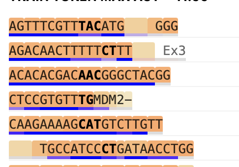

# Llama Clamping

# Project Outline
1. Reproduce [Towards Monosemanticity](https://transformer-circuits.pub/2023/monosemantic-features/index.html)
2. Reproduce [Scaling Monosemanticity](https://transformer-circuits.pub/2024/scaling-monosemanticity/)

# Why clamp?
- **Interpretability**: we can understand the model's behavior by examining the effect of clamping on the model's predictions.
- **Steerability**: we can control the model's behavior by clamping features that we want to be more or less active.
    - "Golden Gate Bridge" Claude
- **Usability**: feature activation represents a new model affordance that can be used to extract information from the model. 
    - Detect errors in code compilation

Why is this cool? Right now, if you want the model to do something or perform some kind of analysis, you ask/prompt it. But the key insight of interpretability is that *the model is computating activations across all features while generating responses, including the ones that you're not asking for*, and that's free information. These activations include extremely useful and highly abstract details such as:

- Will this code compile?
- What language is this?
- What is the sentiment of this text?

And, again, *the model is computing all of these without you having to prompt for it*.

## Example use cases

Here's a feature from Claude Sonnet that activates when a function has a code error.

You could imagine in your code editor that the syntax highlighter would also light up to highlight the error, before you've even run the code.

# 1. Reproduce "Towards Monosemanticity"
## 1a. Train a single-layer transformer on the Pile dataset.
[ [Original paper](https://transformer-circuits.pub/2023/monosemantic-features/index.html#setup-transformer) ]

### Necessity
Is this really necessary, or can I take a pretrained model with multiple layers and just use the last layer? Based on the Scaling Monosemanticity paper, I think not.

> "Note that this linear structure makes it even more likely that features should be linear. On the one hand, this means that the linear representation hypothesis is more likely to hold for this model. On the other hand, it potentially means that our results are less likely to generalize to multilayer models. Fortunately, others have studied multilayer transformers with sparse autoencoders and found interpretable linear features, which gives us more confidence that what we see in the one-layer model indeed generalizes."

- (tentatively) Found 600+ Monosemantic Features in a Small LM Using Sparse Autoencoders  
Smith, L., 2023.
- Really Strong Features Found in Residual Stream  
Smith, L., 2023.
- AutoInterpretation Finds Sparse Coding Beats Alternatives  
Cunningham, H., 2023.

They actually train two identical transformers with different seeds to investigate feature universality.

### Training Specs
Specs (from [Problem Setup](https://transformer-circuits.pub/2023/monosemantic-features/index.html#problem-setup)): 

|               | Transformer                                        | Sparse Autoencoder                        |
|---------------|----------------------------------------------------|-------------------------------------------|
| **Layers**    | 1 Attention Block                                  | 1 ReLU (up)                               |
|               | 1 MLP Block (ReLU)                                 | 1 Linear (down)                           |
| **MLP Size**  | 512                                                | 512 (1×) – 131,072 (256×)                 |
| **Dataset**   | The Pile [19] (100 billion tokens)                 | Transformer MLP Activations (8 billion samples) |
| **Loss**      | Autoregressive Log-Likelihood                      | L2 reconstruction + L1 on hidden layer activation |

### Notes
- Why so many tokens? 
  > We can highly overtrain a one-layer transformer quite cheaply. We hypothesize that a very high number of training tokens may allow our model to learn cleaner representations in superposition.

## 1b. Train a sparse autoencoder on the activations of the transformer.
> "We think it would be very helpful if we could identify better metrics for dictionary learning solutions from sparse autoencoders trained on transformers."

| | Specs|
|-|-|
| **Layers** | 1 ReLU (up) |
| | 1 Linear (down) |
| **Optimizer** | Adam |
| **Loss** | MSE + L1 to encourage sparsity |
| **Samples** | 8 billion |

### Diagram

It's a sparse autoencoder, so it's actually rather simple. Since the goal is for the sparse representation to *over-complete* the latent features (aka, learning the monosemantic representations), the encoded representation $h_j$ must be much larger than the original MLP output layer $x_j$ for the $j$-th sample. In the original paper, the MLP output size $n$ is 512 and the hidden size (aka the number of monosemantic features $m$) is ablated across 8x-256x (4096 - 131072).

#### The encoder
The sparse representation of $j$-th example is generated by a ReLU activation:

$$ 
f(x^j) = \text{ReLU}(W_{\text{up}}^T (x_j - b_{\text{down}}) + b_{\text{up}})
$$

where $W_{\text{up}}$ is the encoder weight matrix and $b_{\text{up}}$ is the encoder bias vector.

| | **shape** |
|-|-|
| $x_j$ | ($n$, 1) |
| $W_{\text{up}}$ | ($n$, $m$) |
| $b_{\text{up}}$ | ($m$, 1) |
| $b_{\text{down}}$ | ($n$, 1) |

$f(x^j)$ is representing the distribution of the monosemantic features across the $j$-th example. For example, if $j$ is `gtcact`, then $f(x^j)$ would be close to a one-hot encoding of the DNA feature, and if $j$ is `مرحبا`, then $f(x^j)$ would be close to a one-hot encoding of the Arabic feature.

#### The decoder

We now want to reconstruct the original MLP output $x_j$ from the encoded representation $f(x^j)$. The reconstructed example $\hat x_j$ is generated by a linear transformation

$$
\hat x_j = W_{\text{down}}^T f(x^j) + b_{\text{down}}
$$

where $W_{\text{down}}$ is the decoder weight matrix and $b_{\text{down}}$ is the decoder bias vector.

| | **shape** |
|-|-|
| $f(x^j)$ | ($m$, 1) |
| $W_{\text{down}}$ | ($m$, $n$) |
| $b_{\text{down}}$ | ($n$, 1) |

You can think of each row of $W_{\text{down}}$ as a monosemantic feature, and each index of $W_{\text{down}}$ as a spread of that feature across the MLP output, or "how to compose activations to maximize that feature."

Crucially, **$W_{\text{down}}$ *contains* the monosemantic features** - each row of $W_{\text{down}}$ is a monosemantic feature, $d_i \in \mathbb{R}^{M}$, called a *direction*: it represents how much of a monosemantic feature is spread across all of the MLP's activation indices. We can thus represent each original MLP output $x_j$ as a linear combination of the monosemantic features:

$$
x^j \approx \hat x^j = \sum_{i=1}^{I} f_i(x^j) d_i + b_{\text{down}}
$$

where $f_i(x^j)$ is the spread of the $i$-th monosemantic feature across the MLP output $x_j$, determined by passing $x^j$ through the encoder.

When we go on to *ablate* the monosemantic features (aka clamping), we're going to pick a feature $i$, get its direction $d_i$, get its spread across the orginal MLP output $f_i(x_j)$, and subtract the feature's contribution to the MLP output:

$$
x^j_{\text{ablated}} = x^j - f_i(x^j) d_i
$$

### Notes
- "we periodically check for neurons which have not fired in a significant number of steps and reset the encoder weights on the dead neurons to match data points that the autoencoder does not currently represent well."
- How to know it's working
    - manual inspection
    - feature density: the number of "live" features and the percentage of tokens on which they fire
    - reconstruction loss
    - toy models

- We want to measure and target high feature *specificity* and *sensitivity* (i.e. precision and recall).

## 1c. Building interfaces to explore learned features.

### The `FeatureInspector` tool
[ [demo](https://transformer-circuits.pub/2023/monosemantic-features/vis/a1.html) ]
- we'll teat each box as a product feature that we can add incrementally.
- top priorities: histogram of max pos and neg logits, and autointerp.

### The `TextInspector` tool
[ [demo](https://transformer-circuits.pub/2023/monosemantic-features/vis/a1-abstract.html) ]

### 1d. Investigate learned features

Looking for: 
1. The learned feature activates with high specificity for the hypothesized context. (When the feature is on the context is usually present.)
2. The learned feature activates with high sensitivity for the hypothesized context. (When the context is present, the feature is usually on.)
3. The learned feature causes appropriate downstream behavior.
4. The learned feature does not correspond to any neuron.

Across: 
- Arabic
- DNA sequences

Via:
> "Numerical proxies that represent the log-likelihood ratio of a string under the hypothesis vs under the full empirical distribution of the dataset."

$$
c(\text{s}, \text{context}) = \log \left( \frac{P(s \, | \, \text{context})}{P(s)} \right) 
$$

### Example proxy: a string of DNA, `gtcact`.
[ [Reference appendix](https://transformer-circuits.pub/2023/monosemantic-features/index.html#appendix-proxies) ]
- $P(\text{gtcact})$ is the full empirical distribution, which we could model as a uniform distribution over the number of tokens, ie 

$$
P(s) = \left(\frac{1}{\text{|tokens|}}\right)^{6}
$$

- $P(\text{gtcact} \, | \, \text{context})$ is the likelihood of the string given that the context the string was generated under was DNA, ie (under naive conditions)

$$
P(s \, | \, \text{DNA}) = \left( \frac{1}{4} \right)^6
$$

Note that we can't actually approximate the prior of $P(\text{DNA})$ (lol).

So our proxy score is then

$$
c(\text{gtcact}, \text{DNA}) = \log \left( \frac{P(s \, | \, \text{DNA})}{P(s)} \right) = \log \left( \frac{\left( \frac{1}{4} \right)^6}{\left(\frac{1}{\text{|tokens|}}\right)^{6}} \right) = 6 \log \left( \frac{\text{|tokens|}}{4} \right),
$$

and since $|\text{tokens}| >> 4$, this is a positive number.

Now if the string were not DNA, eg `hello`, then $P(s \, | \, \text{DNA}) = 0$, then

$$
c(\text{hello}, \text{DNA}) = \log 0 = -\infty,
$$

so we're going to want to clamp strings that are impermissible under the context.

#### Activation Specificity
> Does the feature only activate when the string is related?

We plot the distribution of feature activations weighted by activation level. Most of the magnitude of activation provided by this feature comes from dataset examples which are in Arabic script.

#### Activation Sensitivity
> When the string is related, does the feature activate?

Our target is to reproduce this finding: 
**"we find a Pearson correlation of 0.74 between the activity of our feature and the activity of the Arabic script proxy (thresholded at 0), over a dataset of 40 million tokens."**

#### Feature Downstream Effects & Feature Ablations

!!! This is the most important part of the paper, because this is how we create clamping !!!

[ [Ref](https://transformer-circuits.pub/2023/monosemantic-features/index.html#appendix-feature-ablations) ]

> "We perform feature ablations by running the model on an entire context up through the MLP layer, running the autoencoder to compute feature activations, subtracting the feature direction times its activation from the MLP activation on each token in the context (replacing $x^j$ with $x^j - f_i(x^j) d_j$) and then completing the forward pass. We record the resulting change in the predicted log-likelihood of each token in the context in the color of an underline of that token. Thus if a feature were active on token [B] in the sequence [A][B][C], and ablating that feature reduced the odds placed on the prediction of C, then there would be an orange background on [B] (the activation) and a blue underline on [C] (the ablation effect), indicating that ablating that feature increased the model’s loss on the prediction of [C] and hence that feature is responsible for improving the model’s ability to predict [C] in that context.

So in this example, there's a lot of blue, because the context of DNA feature improves the predictive capacity for the next token, and if we ablate the DNA feature down, the loss increases. 

# 2. Reproduce "Scaling Monosemanticity"

> "For clarity, this is the 3.0 version of Claude 3 Sonnet, released March 4, 2024. It is the exact model in production as of the writing of this paper. It is the finetuned model, not the base pretrained model (although our method also works on the base model)."

> "In this work, we focused on applying SAEs to residual stream activations halfway through the model (i.e. at the “middle layer”). We made this choice for several reasons. First, the residual stream is smaller than the MLP layer, making SAE training and inference computationally cheaper. Second, focusing on the residual stream in theory helps us mitigate an issue we call “cross-layer superposition” (see Limitations for more discussion). We chose to focus on the middle layer of the model because we reasoned that it is likely to contain interesting, abstract features (see e.g., 
[11, 12, 13])."

> "With this proxy, we can treat dictionary learning as a standard machine learning problem, to which we can apply the “scaling laws” framework for hyperparameter optimization (see e.g. [14, 15]). In an SAE, compute usage primarily depends on two key hyperparameters: the number of features being learned, and the number of steps used to train the autoencoder (which maps linearly to the amount of data used, as we train the SAE for only one epoch). The compute cost scales with the product of these parameters if the input dimension and other hyperparameters are held constant."
